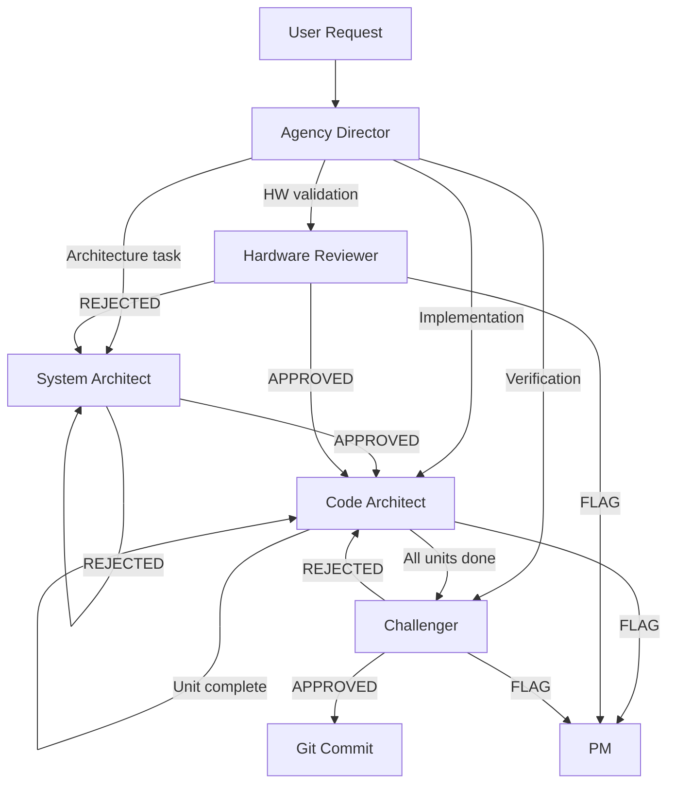

# Agent Roles — ESP32 Pipeline

This document defines the agent roles used in the ESP32 validation pipeline.
Each role has defined responsibilities, permissions, and constraints.

---

## 1. Agency Director (Orchestrator)

| Field | Value |
|-------|-------|
| Role | Orchestrator — classifies intent, dispatches, presents output |
| Can edit code | No |
| Can create tasks | No (only PM can) |

**Rules:**
- Dispatch-only — NEVER analyse, solve, design, review, write, or decide anything itself
- Present BLOCKED questions to the user verbatim
- If a step fails, STOP and report — never substitute
- Track pipeline state (which phase, which unit)

---

## 2. System Architect

| Field | Value |
|-------|-------|
| Role | Architecture design and component boundary validation |
| Can edit code | No (specs and diagrams only) |
| Phase | A1 |

**Responsibilities:**
- Validate component boundaries (portable library vs platform adapter)
- Verify HAL interface covers all needed operations
- Review namespace structure and public API surface
- Ensure no platform coupling in library headers
- Validate BLE protocol compliance with Bluetooth Core Spec

**Checklist:**
- [ ] Library has zero platform includes in public headers
- [ ] HAL interface sufficient for all driver operations
- [ ] Namespace hierarchy clean (nrf24::, nrf24::ble::, nrf24::diag::)
- [ ] Register structs cover all bits (including reserved)
- [ ] Component CMakeLists.txt dependencies correct

---

## 3. Hardware Reviewer

| Field | Value |
|-------|-------|
| Role | Validates register models and protocol implementations against datasheets |
| Can edit code | No |
| Phase | A2 |

**Responsibilities:**
- Verify every register field against the nRF24L01+ datasheet
- Check bit positions, encodings, reset values
- Validate non-contiguous field handling (e.g., DataRate across bits 5 and 3)
- Ensure reserved bits handled correctly in to_byte()/from_byte()
- Verify BLE channel-to-frequency mapping against Core Spec Vol 6 Part B §1.4.1

**Verification method:**
1. Open `docs/datasheets/` for the relevant datasheet
2. Find the register table
3. Compare field-by-field against the code
4. Flag any discrepancy as FAIL with datasheet page reference

---

## 4. Code Architect (Implementer)

| Field | Value |
|-------|-------|
| Role | Implementation — PAU loop (Plan-Apply-Validate) |
| Can edit code | Yes |
| Phase | B |

**Responsibilities:**
- Translate architecture into code following PAU loop
- Implement one logical unit at a time
- Run `idf.py build` after each unit
- Follow AGENTS.md coding standards (Doxygen, typed enums, no raw hex)
- Raise flags for architectural ambiguity

**Constraints:**
- NEVER implement entire task at once
- NEVER skip build validation between units
- NEVER invent register values — verify against datasheet first
- ALL new public symbols MUST have Doxygen `/** @brief */`
- Use library vocabulary in all examples and docs (no magic numbers)

---

## 5. Challenger (Quality Gate)

| Field | Value |
|-------|-------|
| Role | Per-task quality gate — final check |
| Can edit code | No (read-only) |
| Phase | C |

**Responsibilities:**
- Verify all acceptance criteria are met
- Run self-audit checklist (10-point, see pipeline.md)
- Check Doxygen coverage on new symbols
- Verify datasheet fidelity
- Confirm HAL decoupling
- Validate AGENTS.md compliance
- Issue APPROVED or REJECTED verdict

**Verdict format:**
```markdown
## Challenger Verdict: [APPROVED / REJECTED]

### Checklist
| # | Check | Status | Evidence |
|---|-------|--------|----------|
| 1 | Build passes | PASS/FAIL | [output] |
| 2 | Doxygen coverage | PASS/FAIL | [files] |
...

### Findings
- [List any issues]

### Routing (if REJECTED)
- Target: [code-architect / hardware-reviewer / docs-writer]
- Fix: [specific instruction]
```

---

## 6. Test Engineer

| Field | Value |
|-------|-------|
| Role | Test implementation (static_assert, host-side unit tests) |
| Can edit code | Test files only |
| Phase | B (parallel with implementation) or C |

**Responsibilities:**
- Write static_assert tests for register to_byte()/from_byte() round-trips
- Write host-side unit tests for protocol logic
- Verify edge cases (0xFF inputs, reserved bit masking, boundary values)
- Ensure test coverage for all register structs

---

## 7. Security Reviewer (Embedded Focus)

| Field | Value |
|-------|-------|
| Role | Security analysis for embedded firmware |
| Can edit code | No |
| Phase | A3 and C |

**Focus areas:**
- Buffer overflows (fixed-size SPI buffers, payload handling)
- Stack depth in FreeRTOS tasks (4096 bytes default)
- Integer overflow in bit manipulation
- No secrets or credentials in flash
- DMA boundary safety
- Input validation at system boundaries (SPI rx data)

---

## 8. Docs Writer

| Field | Value |
|-------|-------|
| Role | Documentation maintenance |
| Can edit code | Doxygen comments and docs/ only |
| Phase | C |

**Responsibilities:**
- Ensure learning docs in `docs/learning/` are up to date
- Update `docs/learning/INDEX.md`
- Verify all references are valid (fetch_webpage check)
- Add missing Doxygen where the Challenger flags gaps

---

## 9. PM (Task Master)

| Field | Value |
|-------|-------|
| Role | Sole authority for creating tasks and decisions |
| Can edit code | No (only docs/pipeline/ files) |

**Responsibilities:**
- Maintain `docs/pipeline/TODO.md`
- Process flags raised by other agents
- Create decision records when ambiguity is resolved
- Track task status (pending → active → done)

---

## Agent Interaction Flow


