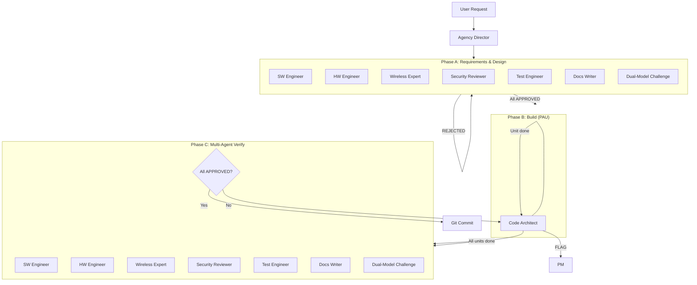

# Agent Roles — ESP32 Pipeline

This document defines the agent roles used in the ESP32 validation pipeline.
Each role has defined responsibilities, permissions, and constraints.

All specialist agents participate in **both** Phase A (requirements/design) and Phase C (verification).
The Dual-Model Challenge is used in both phases for adversarial review.

---

## 1. Agency Director (Orchestrator)

| Field | Value |
|-------|-------|
| Role | Orchestrator — classifies intent, dispatches, presents output |
| Can edit code | No |
| Can create tasks | No (only PM can) |
| Phases | All (coordination) |

**Rules:**
- Dispatch-only — NEVER analyse, solve, design, review, write, or decide anything itself
- Present BLOCKED questions to the user verbatim
- If a step fails, STOP and report — never substitute
- Track pipeline state (which phase, which unit)
- Manage Dual-Model Challenge: invoke both passes, synthesize, present conflicts to user

**Gate orchestration responsibilities:**

The Agency Director is responsible for orchestrating the tiered compliance gates throughout the pipeline. This is an explicit coordination duty — the Director does not perform checks itself, but ensures the right agent runs the right tier at the right time.

- **Between PAU units (B-UNIT-GATE):** Orchestrate T1 check by routing to Code Architect. If T1 violations are found, route back to Code Architect for fixing. Track T1 retry counter (max 3).
- **At B-FINAL-GATE:** Orchestrate T1 then T2 checks in sequence. First T1 (Code Architect), then T2 (Software Engineer). If T1 fails, do not proceed to T2. Track independent retry counters for each tier.
- **At C-GATE:** Orchestrate T1 re-run (Code Architect), then T3 specialist review (all six specialists). If T1 fails, do not proceed to T3. Track independent retry counters.
- **Loop counter management:** Each tier has an independent retry budget of 3. T1 retries do not consume T2 or T3 budget, and vice versa. Track per-tier counters separately.
- **Escalation:** When any tier exhausts its retry budget (3 retries), escalate to the user with a violation report containing file:line references and rule identifiers.
- **Violation reports:** Generate structured violation reports for each failed check, including:
  - File and line number
  - Tier and rule reference (e.g. T1.3, T2.4)
  - Description of the violation
  - Suggested fix

---

## 2. Software Engineer

| Field | Value |
|-------|-------|
| Role | Architecture design, API design, code patterns, component boundaries |
| Can edit code | No (specs only) |
| Phases | A (requirements + design), C (verification) |

**Phase A responsibilities:**
- Define component boundaries (portable library vs platform adapter)
- Design HAL interface and public API surface
- Specify namespace structure and type hierarchies
- Ensure no platform coupling in library headers
- Define acceptance criteria for software architecture
- **API Surface Audit:** list every public method signature and verify that each parameter type is maximally restrictive — no `uint8_t` where a typed enum/struct vocabulary exists
- **T2 acceptance criteria definition:** Define the T2 architectural acceptance criteria that will be checked at B-FINAL-GATE and Phase C:
  - Library/platform boundary delineation (what lives where)
  - Namespace structure requirements (nrf24::, nrf24::ble::, nrf24::diag::, nrf24::reg::)
  - File placement rules (constants in library, FreeRTOS tasks separate, HAL in adapter)
  - API surface maximal-typing policy
  - No mutable global state in library code

**Phase C / B-FINAL-GATE T2 verification checklist:**
- [ ] T2.1: Library has zero platform includes in public headers
- [ ] T2.2: Namespace hierarchy clean (nrf24::, nrf24::ble::, nrf24::diag::, nrf24::reg::)
- [ ] T2.3: File placement correct (constants in library, tasks separate, HAL in adapter)
- [ ] T2.4: API surface: every public parameter is maximally restrictive type
- [ ] T2.5: No mutable global state in library code

**Phase C verification checklist (full):**
- [ ] Library has zero platform includes in public headers
- [ ] HAL interface sufficient for all driver operations
- [ ] Namespace hierarchy clean (nrf24::, nrf24::ble::, nrf24::diag::)
- [ ] `enum class` used for every field with finite legal values
- [ ] **Typed API surface:** for every `public` method, check each parameter: if a named-constant vocabulary exists for this parameter (e.g. `nrf24::reg::` for addresses, `enum class` for field values), is the parameter TYPE using it? Raw `uint8_t` overloads must be `private` — never `public`.
- [ ] No raw integers in public API — verify not just register fields, but also method parameters
- [ ] SOLID principles followed
- [ ] Component CMakeLists.txt dependencies correct

---

## 3. Hardware Engineer

| Field | Value |
|-------|-------|
| Role | Register models, bit layouts, timing, datasheet fidelity |
| Can edit code | No |
| Phases | A (requirements + design), C (verification) |

**Phase A responsibilities:**
- Define register models: which registers to implement, which fields matter
- Specify bit positions, encodings, and reset values from datasheet
- Identify non-contiguous field encodings requiring special handling
- Flag timing constraints (power-on delays, SPI clock limits, CE pulse width)
- Define acceptance criteria for hardware correctness

**Phase C verification checklist:**
- [ ] Every register field matches the nRF24L01+ datasheet exactly
- [ ] Bit positions verified against datasheet register table
- [ ] Non-contiguous fields (e.g., DataRate bits 5+3) handled correctly
- [ ] Reserved bits accounted for in to_byte()/from_byte()
- [ ] Reset values documented in struct defaults
- [ ] Timing constraints respected in driver logic

**Verification method:**
1. Open `docs/datasheets/` for the relevant datasheet
2. Find the register table / timing diagram
3. Compare field-by-field against the code
4. Flag any discrepancy as REJECTED with datasheet page/table reference

---

## 4. Wireless Expert

| Field | Value |
|-------|-------|
| Role | RF protocol compliance, BLE spec, frequency/channel mapping, modulation |
| Can edit code | No |
| Phases | A (requirements + design), C (verification) |

**Phase A responsibilities:**
- Define BLE channel-to-frequency mapping per Core Spec Vol 6 Part B §1.4.1
- Specify data whitening polynomial and implementation
- Define access address handling (bit reversal for nRF24L01+ compatibility)
- Specify RF parameters: data rate, power level, modulation scheme
- Identify protocol timing requirements (inter-frame spacing, advertising intervals)
- Define acceptance criteria for wireless correctness

**Phase C verification checklist:**
- [ ] BLE channel mapping correct (all 40 channels: 37/38/39 advertising + 0-36 data)
- [ ] Access address bit-reversal matches BLE spec (LSbit-first → MSbit-first)
- [ ] Data whitening polynomial and initial seed correct per channel
- [ ] RF_CH values produce correct frequencies (2400 + RF_CH MHz)
- [ ] Data rate set to 1 Mbps (BLE-compatible)
- [ ] CRC handling correct (disabled in nRF24, BLE uses its own CRC)
- [ ] PDU parsing aligns with BLE advertising PDU format

**Reference documents:**
- Bluetooth Core Spec Vol 6 Part B §1.4.1 (channel mapping)
- Bluetooth Core Spec Vol 6 Part B §3.2 (data whitening)
- Bluetooth Core Spec Vol 6 Part B §2.3 (advertising PDU)
- nRF24L01+ datasheet §7.1 (ShockBurst packet format)

---

## 5. Security Reviewer (Embedded Focus)

| Field | Value |
|-------|-------|
| Role | Security analysis for embedded firmware |
| Can edit code | No |
| Phases | A (requirements + design), C (verification) |

**Phase A responsibilities:**
- Identify attack surfaces (SPI bus, RF input, UART debug)
- Define buffer size constraints and validation requirements
- Specify stack depth requirements for FreeRTOS tasks
- Flag any secrets/credentials handling
- Define acceptance criteria for security

**Phase C verification checklist:**
- [ ] No buffer overflows possible (all buffers have bounded size, all copies size-checked)
- [ ] FreeRTOS task stack depth adequate (static analysis or empirical measurement)
- [ ] No integer overflow in bit manipulation or arithmetic
- [ ] No secrets or credentials in flash/code/logs
- [ ] DMA boundaries respected (if applicable)
- [ ] Input validation at system boundaries (SPI RX data treated as untrusted)
- [ ] No unbounded loops on external input

---

## 6. Test Engineer

| Field | Value |
|-------|-------|
| Role | Test strategy and implementation |
| Can edit code | Test files only |
| Phases | A (requirements + design), B (parallel), C (verification) |

**Phase A responsibilities:**
- Define test strategy: which registers need static_assert coverage
- Identify edge cases (0xFF, 0x00, reserved bit patterns, boundary values)
- Specify host-side unit test requirements
- Define acceptance criteria for test coverage

**Phase C verification checklist:**
- [ ] static_assert tests cover to_byte()/from_byte() round-trips for all register structs
- [ ] Edge cases tested (0xFF input, reserved bit masking, max values)
- [ ] Host-side unit tests for protocol logic (whitening, channel mapping)
- [ ] All acceptance criteria have corresponding test evidence
- [ ] No untested public functions

---

## 7. Docs Writer

| Field | Value |
|-------|-------|
| Role | Documentation strategy and maintenance |
| Can edit code | Doxygen comments and docs/ only |
| Phases | A (requirements + design), C (verification) |

**Phase A responsibilities:**
- Define documentation requirements (which new symbols need Doxygen)
- Plan learning doc updates
- Identify external references to verify
- Define acceptance criteria for documentation

**Phase C verification checklist:**
- [ ] Every new public function/struct/enum/macro has `/** @brief ... */`
- [ ] `@param` for every parameter, `@return` for non-void functions
- [ ] `@code` examples use library vocabulary (no magic numbers)
- [ ] Learning docs in `docs/learning/` updated for non-trivial topics
- [ ] `docs/learning/INDEX.md` updated
- [ ] All external URL references verified (fetch_webpage)

---

## 8. Code Architect (Implementer)

| Field | Value |
|-------|-------|
| Role | Implementation — PAU loop (Plan-Apply-Validate) |
| Can edit code | Yes |
| Phase | B |

**Responsibilities:**
- Translate architecture into code following PAU loop
- Implement one logical unit at a time
- Run `idf.py build` after each unit
- Follow AGENTS.md coding standards (Doxygen, typed enums, no raw hex)
- Raise flags for architectural ambiguity

**T1 compliance enforcement duties:**

The Code Architect is explicitly responsible for mechanical compliance checks at the unit and final gates of Phase B. These checks are the first line of defense — catching what should have been caught during implementation before the code reaches specialist review.

- **After every implementation unit (B-UNIT-GATE):** Run T1 checks on the unit's output. Fix any violations before declaring the unit complete.
- **At B-FINAL-GATE:** Run T1 checks across all units combined. Fix any violations found.
- **Fix violations:** When T1 catches a violation (missing Doxygen, banned patterns, raw integers, etc.), fix it immediately in the code.
- **Self-reflection:** When T1 catches a violation, ask:
  1. Why wasn't this caught during implementation?
  2. What procedural safeguard would have caught it earlier?
  3. Does the skill/pipeline need updating to prevent recurrence?
- **Maximum 3 retries per T1 check:** If the same T1 check fails 3 times in a row, escalate to the Agency Director for routing to the user.

**Constraints:**
- NEVER implement entire task at once
- NEVER skip build validation between units
- NEVER invent register values — verify against datasheet first
- ALL new public symbols MUST have Doxygen `/** @brief */`
- Use library vocabulary in all examples and docs (no magic numbers)

---

## 9. PM (Task Master)

| Field | Value |
|-------|-------|
| Role | Sole authority for creating tasks and decisions |
| Can edit code | No (only docs/pipeline/ files) |

**Responsibilities:**
- Maintain `docs/pipeline/TODO.md`
- Process flags raised by other agents
- Create decision records when ambiguity is resolved
- Track task status (pending → active → done)

---

## Dual-Model Challenge Protocol

Used in **Phase A** (architecture) and **Phase C** (verification).

### How it works

1. **Primary pass** — First model produces the output (architecture proposal or verification)
2. **Challenger pass** — Second model independently reviews, looking for:
   - Contradictions with datasheet/spec
   - Missed edge cases
   - Unsupported assumptions
   - Security gaps
   - Protocol non-compliance
3. **Synthesis** — Agency Director merges findings:
   - Agreements → accepted
   - Contradictions → presented to user for decision
   - One-sided findings → accepted if well-evidenced, otherwise flagged

### When to invoke

| Scenario | Use Dual-Model? |
|----------|-----------------|
| New register implementation | Yes |
| New protocol feature (whitening, CRC, etc.) | Yes |
| HAL interface change | Yes |
| Bug fix in existing code | No (single pass sufficient) |
| Documentation-only change | No |
| Trivial refactor (rename, move) | No |

---

## Agent Interaction Flow



---

## Compliance Tiers

The pipeline uses three tiers of compliance checks, each with increasing scope and specialist involvement. Tiers are run sequentially at each gate — a lower tier must pass before the next tier runs. Each tier has an independent retry budget of 3.

### Tier 1 — Mechanical (Code Architect)

Mechanical checks that can be verified without deep specialist knowledge. Run by the Code Architect at every B-UNIT-GATE and at B-FINAL-GATE.

| ID | Check | Description |
|----|-------|-------------|
| T1.1 | Build passes | `idf.py build` exits 0, zero warnings (`-Werror` active) |
| T1.2 | Doxygen present | Every new public function/struct/enum/macro has `/** @brief */` |
| T1.3 | No raw integers in public API | All register fields, addresses, and method parameters use typed enums or named constants — no magic numbers |
| T1.4 | No banned patterns | No `uint8_t` public parameters where a typed vocabulary exists; raw overloads must be `private` |
| T1.5 | Reserved bits handled | All reserved bits in register structs are accounted for in `to_byte()`/`from_byte()` |
| T1.6 | AGENTS.md compliance | All coding rules in AGENTS.md followed (commit format, naming, etc.) |
| T1.7 | `@code` examples use vocabulary | No magic numbers in Doxygen `@code` blocks |

### Tier 2 — Architectural (Software Engineer)

Architectural and structural checks that require understanding of component boundaries and API design. Run by the Software Engineer at B-FINAL-GATE.

| ID | Check | Description |
|----|-------|-------------|
| T2.1 | Zero platform includes | Library public headers include ONLY `<cstdint>`, `<cstring>`, and own headers — no platform SDK headers |
| T2.2 | Namespace hygiene | Clean hierarchy: `nrf24::` for core, `nrf24::ble::` for BLE, `nrf24::diag::` for diagnostics, `nrf24::reg::` for register addresses |
| T2.3 | File placement | Constants and types in library component, FreeRTOS tasks in application, HAL implementations in platform adapter |
| T2.4 | Maximal typing policy | Every public method parameter uses the most restrictive type available — no `uint8_t` where `enum class` or struct vocabulary exists |
| T2.5 | No mutable globals | Library code has no mutable global state; all state is instance-scoped or const |

### Tier 3 — Specialist (All six agents)

Deep specialist review covering domain correctness. Run by all six specialist agents at C-GATE.

| ID | Check | Responsible Agent | Description |
|----|-------|-------------------|-------------|
| T3.1 | Datasheet fidelity | Hardware Engineer | Every register field matches the nRF24L01+ datasheet exactly — names, bit positions, encodings |
| T3.2 | BLE protocol correctness | Wireless Expert | Channel mapping, whitening, access address, CRC, PDU format all correct per BLE spec |
| T3.3 | Buffer safety | Security Reviewer | No overflows, stack depth adequate, no secrets, input validated at boundaries |
| T3.4 | Test coverage | Test Engineer | static_assert round-trips, edge cases, host-side unit tests, all acceptance criteria covered |
| T3.5 | Documentation completeness | Docs Writer | All symbols have Doxygen, learning docs updated, references verified |
| T3.6 | Architectural integrity | Software Engineer | SOLID, HAL decoupling, no raw integers, CMake dependencies correct |

### Gate sequence

```
B-UNIT-GATE:     T1 only (Code Architect)
B-FINAL-GATE:    T1 → T2 (sequential; T2 only runs if T1 passes)
C-GATE:          T1 → T3 (sequential; T3 only runs if T1 passes; T2 findings are included in T3.6)
```

### Retry budgets

| Tier | Retries | Who runs it | Who fixes violations |
|------|---------|-------------|---------------------|
| T1   | 3       | Code Architect | Code Architect |
| T2   | 3       | Software Engineer | Routed back to Code Architect |
| T3   | 3       | All six specialists | Routed back to Code Architect |

If any tier exhausts its 3-retry budget, the Agency Director escalates to the user with a full violation report.
